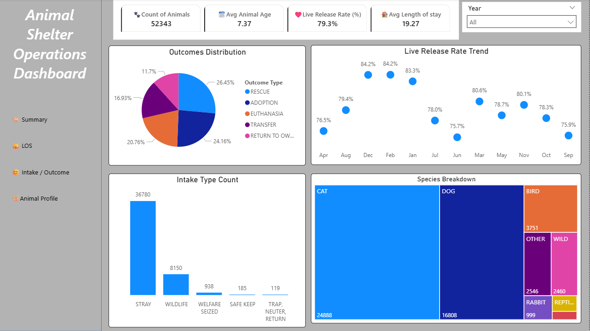

  <a href="#skills">Skills</a> •
  <a href="#projects">Projects</a> •
  <a href="#certificates">Certificates</a> •
  <a href="#Experirnce">Experince</a> •
  <a href="#contact">Contact</a>

<h1 align="center">EMMANUEL TWUMASI AMPOFO</h1>

Data Analyst  ·  UK, Wells.

I am a data analyst with expertise in Python, SQL, Power BI, and Excel, supported by a strong background in Information Technology. I specialize in transforming raw, unstructured data into clear, actionable insights that enable businesses to make faster and more informed decisions.

I work across the full analytics lifecycle—cleaning and transforming data using Python and Pandas, querying and managing databases with MySQL, and developing interactive dashboards in Power BI. My Power BI work includes DAX, Power Query, star schema modeling, and What-If analysis to deliver meaningful and dynamic reports.

In Excel, I create efficient and well-structured reports using Pivot Tables, VLOOKUP, XLOOKUP, and other advanced functions to support data-driven decision-making.

# Skills
## 🚀 DATA & QUERYING

## 📊 VISUALISATION & BI

## 🧠 ANALYTICS METHODS

# PROJECTS
<h1 Animal Shelter Operations </h1>
<a href="https://github.com/KWAKUTWUMASI1/Social-Media">Animal Shelter</a> 

  

🎓 CREDENTIALS
# Certificates

| Provider | Certificate | Link |
|---------|------------|------|
| **Ghana Communication Technology University** | BSc. Information Technology | [View Certificate](https://drive.google.com/file/d/1hx9rO2DKpVmx09F0KxaEuLsDQcVr-Ad8/view?usp=drive_link) |
| **Microsoft Certified** | Azure Data Fundamentals | [View Certificate](https://learn.microsoft.com/api/credentials/share/en-us/EMMANUELTWUMASIAMPOFO-1902/F03AD693162D4092?sharingId=67188209795A0A11) |
| **CompTIA** | Excel Fundamentals | [View Certificate](http://verify.CompTIA.org) |

# EXPERIENCE 💼
- Computer Technician – Ghana Armed Forces  
- IT Specialist – United Nations Mission (UNMISS)  
- Experience in data handling, reporting, and technical support  

<h2 align="center">CONTACT ME</h2>

  <a href="mailto:ampofotwumasiemmanuel@gmail.com">📧 Email</a> |
  <a href="https://www.linkedin.com/in/emmanuel-twumasi-ampofo/">🔗 LinkedIn</a>

